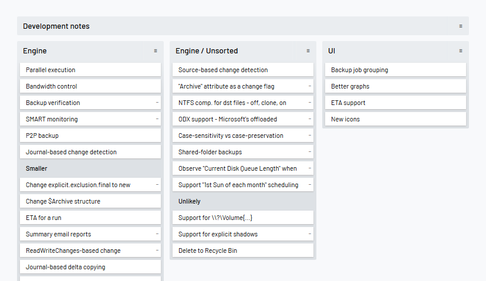

<!--
N.B.: This README was automatically generated by https://github.com/YunoHost/apps/tree/master/tools/README-generator
It shall NOT be edited by hand.
-->

# Nullboard for YunoHost

[](https://dash.yunohost.org/appci/app/nullboard)    
[](https://install-app.yunohost.org/?app=nullboard)

*[Lire ce readme en français.](./README_fr.md)*

> *This package allows you to install Nullboard quickly and simply on a YunoHost server.
If you don't have YunoHost, please consult [the guide](https://yunohost.org/#/install) to learn how to install it.*

## Overview

Minimalist kanban board, focused on compactness and readability

**Shipped version:** 1.0~ynh4

**Demo:** https://nullboard.io/preview

## Screenshots



## Disclaimers / important information

## Limitations

* :warning: Uses localStorage for storing boards/lists/notes, so be careful around clearing your cache.

## Documentation and resources

* Official app website: https://nullboard.io/
* Upstream app code repository: https://github.com/apankrat/nullboard
* YunoHost documentation for this app: https://yunohost.org/app_nullboard
* Report a bug: https://github.com/YunoHost-Apps/nullboard_ynh/issues

## Developer info

Please send your pull request to the [testing branch](https://github.com/YunoHost-Apps/nullboard_ynh/tree/testing).

To try the testing branch, please proceed like that.
```
sudo yunohost app install https://github.com/YunoHost-Apps/nullboard_ynh/tree/testing --debug
or
sudo yunohost app upgrade nullboard -u https://github.com/YunoHost-Apps/nullboard_ynh/tree/testing --debug
```

**More info regarding app packaging:** https://yunohost.org/packaging_apps